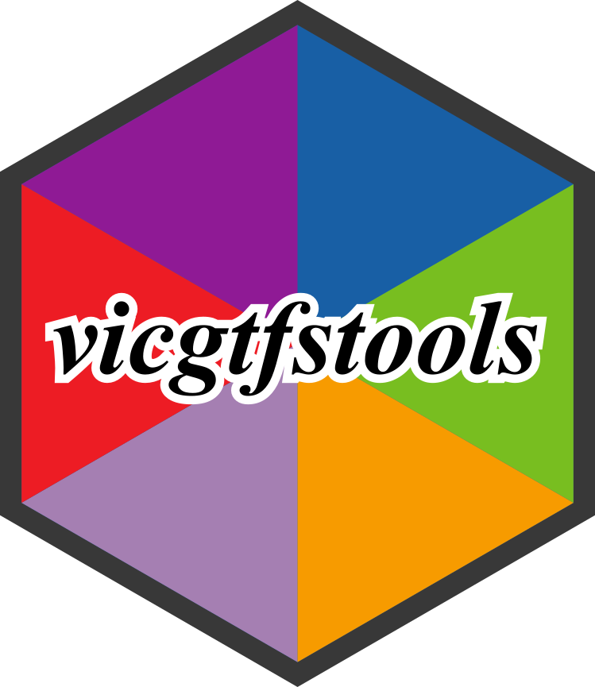

------------------------------------------------------------------------

editor_options: markdown: wrap: 72 ---

# vicgtfstools

<!-- badges: start -->

<!-- badges: end -->

 Tools for downloading, opening, and processing General Transit Feed Specification (GTFS) data from the Victorian Department of Transport and Planning.

## Installation

You can install the development version of vicgtfstools from GitHub:

``` r
# install.packages("devtools")
devtools::install_github("adambain014/vicgtfstools")
```

## Overview

`vicgtfstools` provides a set of functions for working with Victorian public transport data:

- **Download** the latest GTFS schedule from the Department of Transport and Planning open data portal
- **Open** individual transport mode feeds (trains, trams, buses, etc.)
- **Join** multiple feeds while preserving mode metadata
- **Combine** all available modes into a single unified dataset
- **Stitch** Melbourne metro City Loop and through-running train trips into continuous journeys
- **Rename** V/Line coach, V/Line long-distance train, rail replacement bus, and SkyBus routes to their marketed or destination names
- **Tag** regional bus services with geographic classifications across Victoria All GTFS feeds are automatically tagged with `mode_number` and `mode_name` columns for easy filtering and analysis.

## Quick Start

### Download the latest Victorian GTFS data

``` r
library(vicgtfstools)
 
# Download and extract all GTFS feeds
download_latest_vic_gtfs("gtfs")
```

This creates a directory structure like:

```         
gtfs/
├── 1/google_transit.zip    # Regional Train
├── 2/google_transit.zip    # Metro Train
├── 3/google_transit.zip    # Metro Tram
├── 4/google_transit.zip    # Myki Bus (Metro Bus and Regional Town Bus)
├── 5/google_transit.zip    # Regional Coach
├── 6/google_transit.zip    # Regional Bus
├── 10/google_transit.zip   # Interstate
└── 11/google_transit.zip   # SkyBus
```

### Open a specific transport mode

``` r
# Load Metro Train GTFS feed
metro_train <- open_vic_gtfs("gtfs", "Metro_Train")
 
# Explore the data
head(metro_train$routes)
head(metro_train$stops)
 
# Check mode metadata columns
head(metro_train$trips[, c("trip_id", "mode_number", "mode_name")])
```

### Join two modes

``` r
# Load and combine Metro Train and Tram
train <- open_vic_gtfs("gtfs", "Metro_Train")
tram  <- open_vic_gtfs("gtfs", "Metro_Tram")
 
combined <- join_vic_gtfs(train, tram)
 
# Filter by mode
train_routes <- combined$routes[combined$routes$mode_name == "Metro_Train", ]
tram_routes  <- combined$routes[combined$routes$mode_name == "Metro_Tram", ]
```

### Open all modes at once

``` r
# Load and combine all available GTFS feeds
all_gtfs <- open_and_join_all_vic_gtfs("gtfs")
 
# All tables now include mode_number and mode_name columns
head(all_gtfs$routes)
table(all_gtfs$routes$mode_name)
```

### Extract route codes from trip IDs

``` r
library(data.table)
 
# Add line codes to trips for analysis
trips_with_codes <- add_route_code_from_trip_id(all_gtfs$trips)
 
# Analyze services by line
trips_with_codes[, .(n_trips = .N), by = .(mode_name, route_code)]
```

### Stitch City Loop and through-running metro train trips

``` r
# Load Metro Train GTFS
metro_train <- open_vic_gtfs("gtfs", "Metro_Train")
 
# Join a City Loop trip and its return-direction pair into one continuous journey
metro_train <- add_city_loop_trains(metro_train)
 
# Join through-running trips (direction 0/1 pairs sharing a block_id, excluding
# City Loop services) into one continuous journey
metro_train <- add_through_run_trains(metro_train, keep_only_one = FALSE)
 
# Inspect a stitched trip
library(data.table)
stop_times <- as.data.table(metro_train$stop_times)
stop_times[, .(stop_id, stop_sequence, shape_dist_traveled, added)]
```

### Rename routes to marketed or destination names

``` r
# V/Line coach corridors, e.g. "BDE" -> "Bairnsdale (Coach)"
vline_coach <- open_vic_gtfs("gtfs", "Regional_Coach")
vline_coach <- add_coach_names(vline_coach)
 
# V/Line long-distance trains, e.g. destination code -> "Warrnambool"
vline_train <- open_vic_gtfs("gtfs", "Regional_Train")
vline_train <- split_vline_names(vline_train)
 
# Metro train rail replacement buses, e.g. "Replacement Bus (Lilydale)"
metro_train <- open_vic_gtfs("gtfs", "Metro_Train")
metro_train <- add_replacement_bus_names(metro_train)
 
# SkyBus airport shuttles, e.g. "Melbourne City Express"
skybus <- open_vic_gtfs("gtfs", "SkyBus")
skybus <- add_skybus_names(skybus)
```

### Tag regional bus routes by location

``` r
# Load bus GTFS
bus_gtfs <- open_vic_gtfs("gtfs", "Metro_Bus")
 
# Add regional classifications
bus_gtfs_tagged <- tag_myki_bus(bus_gtfs)
 
# View regional distribution
library(data.table)
routes <- as.data.table(bus_gtfs_tagged$routes)
routes[, .N, by = region]
 
# Filter to regional services
regional_routes <- routes[region != "Melbourne"]
```

## Supported Transport Modes

| Mode Number | Mode Name      | Description                                |
|-------------|----------------|--------------------------------------------|
| 1           | Regional_Train | Regional train services                    |
| 2           | Metro_Train    | Melbourne metro trains                     |
| 3           | Metro_Tram     | Melbourne trams                            |
| 4           | Metro_Bus      | Myki Bus (Metro Bus and Regional Town Bus) |
| 5           | Regional_Coach | Regional coach services                    |
| 6           | Regional_Bus   | Regional bus services                      |
| 10          | Interstate     | Interstate services                        |
| 11          | SkyBus         | SkyBus airport services                    |

## Functions

### Core Functions

- `download_latest_vic_gtfs()` - Download and extract the latest Victorian GTFS data
- `open_vic_gtfs()` - Open a specific transport mode's GTFS feed with mode tagging
- `join_vic_gtfs()` - Join two GTFS feeds with mode metadata
- `open_and_join_all_vic_gtfs()` - Open and combine all available feeds
- `add_route_code_from_trip_id()` - Extract route/line codes from trip IDs \### Metro Train Functions
- `add_city_loop_trains()` - Stitch paired City Loop trip directions into a single continuous journey
- `add_through_run_trains()` - Stitch through-running direction 0/1 trip pairs (sharing a `block_id`, excluding City Loop services) into a single continuous journey \### Route Renaming Functions
- `add_coach_names()` - Rename V/Line coach routes to their corridor or destination name
- `split_vline_names()` - Rename V/Line long-distance train routes to their destination name
- `add_replacement_bus_names()` - Append a line-name suffix to Metro train rail replacement bus routes
- `add_skybus_names()` - Rename SkyBus airport routes to their marketed express names \### Bus Functions
- `tag_myki_bus()` - Tag bus routes with regional classifications (Melbourne, Bendigo, Ballarat, Geelong, etc.) \## Enhanced GTFS Features

The Victorian GTFS dataset includes additional features beyond the basic GTFS specification:

- **Transfers** - Transfer information between routes and stops
- **Wheelchair accessibility** - Accessibility data for trips and stops/platforms
- **Pathways** - Detailed path links within stations
- **Station levels** - Multi-level station information
- **Platform information** - Platform numbers and locations for metro train stations
- **Bus replacement services** - Dedicated stops and trip information for rail replacement buses
- **Enhanced tram identifiers** - Business identifiers for improved matching with real-time feeds \### Package-Specific Enhancements

#### City Loop and Through-Run Stitching (Metro Trains)

Melbourne's metro trains often continue service in the opposite direction after reaching their terminus, or run through the City Loop as a linked pair of trips. `add_city_loop_trains()` and `add_through_run_trains()` extend the GTFS data to represent the complete passenger journey as a single trip:

- **Paired trip identification**: Trips sharing a `block_id` across directions are matched into head/tail pairs
- **Continuous stop patterns**: `stop_sequence` and `shape_dist_traveled` are renumbered so the combined journey reads as one trip
- **Duplicate reconciliation**: Shared junction stops (e.g. Flinders Street) are collapsed to a single row with reconciled arrival/departure times
- **Flexible retention**: `add_through_run_trains()` supports `keep_only_one` to drop the redundant directional duplicate once stitched \#### Route Renaming V/Line coach, V/Line long-distance train, Metro rail replacement bus, and SkyBus routes are published with route codes rather than the names passengers recognise. `add_coach_names()`, `split_vline_names()`, `add_replacement_bus_names()`, and `add_skybus_names()` map these codes and long names to their marketed or destination names, covering over 50 V/Line coach corridors, 8 long-distance train destinations, 18 metro line replacement bus suffixes, and 5 SkyBus express services.

#### Regional Bus Classification

The `tag_myki_bus()` function adds geographic context to bus routes, classifying services across: - Metropolitan Melbourne - Regional cities: Bendigo, Ballarat, Geelong, Seymour, Kilmore - Regional towns: Warragul, Latrobe Valley, Wallan, Ballan, Bacchus Marsh \## Data Currency

- **Update frequency**: As needed
- **Coverage**: Rolling 30 days from the date of export
- **Note**: Some route information may be incomplete for the full period if service details are not yet available \## Data Source

GTFS data is sourced from the [Victorian Department of Transport and Planning Open Data Portal](https://opendata.transport.vic.gov.au/dataset/gtfs-schedule). The data is updated regularly and includes schedules, routes, stops, and service information for all Victorian public transport modes.

**License**: Creative Commons Attribution 4.0 International

## Requirements

- R \>= 4.0.0

- Internet connection (for downloading GTFS data)

- \~500 MB disk space (for extracted GTFS files) \## Dependencies

- `gtfstools` - For reading GTFS feeds

- `data.table` - For efficient data processing, joins, and row-binding

- `rlang` - For utilities

- `utils` - For downloading and extracting files \## License

MIT License - see [LICENSE](LICENSE) file for details

## Contributing

Please feel free to submit a PR

## Issues

Found a bug or have a feature request? Please open an issue on [GitHub](https://github.com/adambain014/vicgtfstools/issues).

## Acknowledgments

- Data provided by the Victorian Department of Transport and Planning
- Built using the [`gtfstools`](https://ipeagit.github.io/gtfstools/) package
